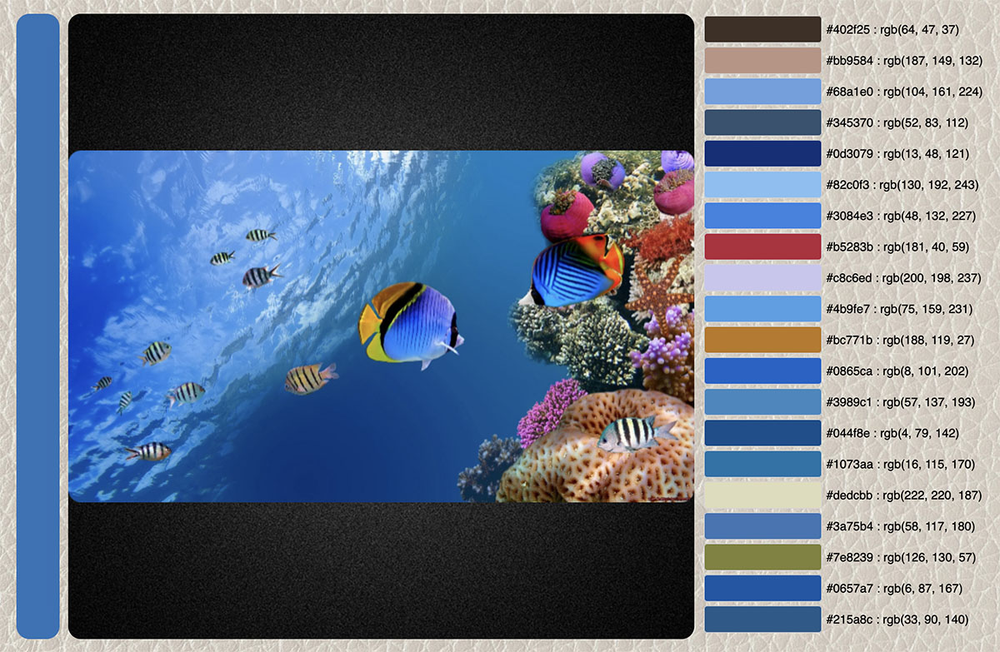

# imagine-colors
Simple web app to analyze the main colors in an image.

This app was written using the [COLOR THIEF](https://lokeshdhakar.com/projects/color-thief/#examples) Javascript class by Lokesh Dhakar. That part of this app is used via the MIT License and credit given to [Lokesh Dhakar](https://github.com/lokesh/color-thief).

I wrote this app to quickly grab the color palette from an image when using it in a design. It also gave me the challenge of figuring out
how to load an image into a webpage via either the OS file dialog or drag and drop.

## Usage
The UI consists of three sections as seen below. The left bar displays the most dominant color. The center section 
displays the image that was opened or dropped. Images display in their correct ratios. The right section shows palette 
swatches with RGB and hex values of the 20 top most common colors in the image. This section may appear below the 
others if the browser window is too small. I haven't added dynamic sizing to the app.

A live demo of Image Colors can be accessed here: [Image Colors](https://www.stevenlyles.net/playground/imagine/index.html)
